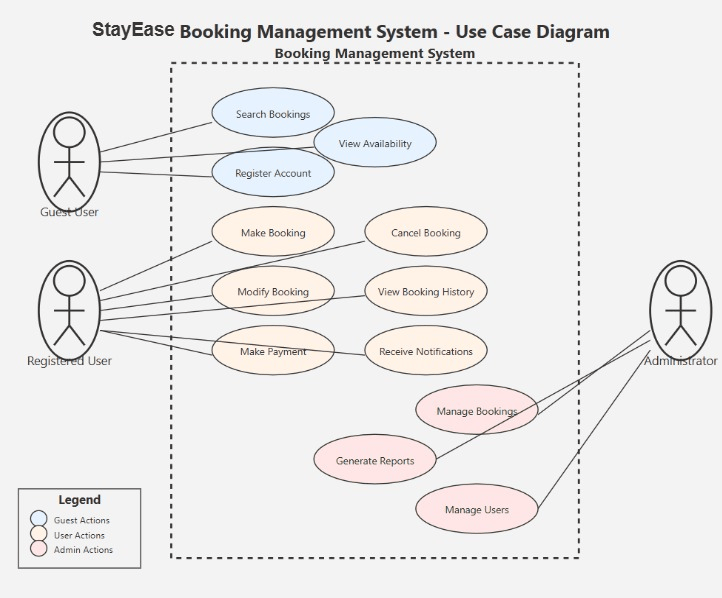

# Requirement Analysis in Software Development

This repository contains a comprehensive guide to Requirement Analysis in the Software Development Life Cycle (SDLC). It serves as a practical resource for understanding how to gather, analyze, and document requirements for software projects, using a booking management system (StayEase: Airbnb Clone Project) as a case study.

## Purpose
To demonstrate a systematic approach to requirement analysis, covering key concepts, methodologies, and best practices essential for successful software development projects. It outlines essential concepts, activities, and deliverables needed for effective software requirement planning. The goal is to simulate real-world project preparation through detailed documentation, use case diagrams, and structured analysis.

## What is Requirement Analysis?

Requirement Analysis is a critical phase in the Software Development Life Cycle (SDLC) that involves the systematic identification, documentation, and management of the needs and expectations of stakeholders for a software system. It serves as the foundation where stakeholders, product managers, and developers come together to identify, gather, document, and validate the requirements of a software system. 

It serves as a roadmap that defines what the system should do (functional requirements) and how it should perform (non-functional requirements), aligning both business objectives and user needs.

During this phase, business analysts and developers work closely with stakeholders to understand what the system should do, how it should perform, and what constraints it must operate within. This process transforms abstract ideas and business needs into concrete, actionable requirements that guide the development team throughout the project lifecycle.

### The Purpose of Requirement Analysis:
- To understand **what the client wants**
- To define **clear scope and expectations**
- To reduce **risks of miscommunication** and costly rework
- To guide the design, development, and testing phases

Requirement analysis acts as the **blueprint** for the software solution, ensuring that all parties have a clear, shared understanding of what will be built, reducing the risk of miscommunication, scope creep, and project failure.

## Why is Requirement Analysis Important?

Requirement Analysis is essential because it lays the groundwork for a successful software project. Skipping or rushing this step often leads to costly delays, misaligned features, and frustrated users.

Here are key reasons why it matters:

1. **Clarity and Alignment**
   - It ensures all stakeholders share a common understanding of what the system should do. This eliminates ambiguity and prevents scope creep during development. 

2. **Reduces Rework and Wasted Effort**
   - Clearly defined requirements help developers build exactly what is needed. This prevents unnecessary features and minimizes time spent on revisions or corrections.

3. **Improves Project Planning and Estimation**
   - Accurate requirements make it easier to estimate project timelines, resource allocation, and development cost—critical for meeting deadlines and budgets.

4. **Enhances Communication**
   - Requirement documents serve as a communication bridge between technical and non-technical stakeholders, reducing confusion throughout the SDLC.

5. **Supports Testing and Validation**
   - Test cases and acceptance criteria are built directly from well-defined requirements, ensuring the final product meets expectations.

## Key Activities in Requirement Analysis

Requirement Analysis is a multi-step process that involves various activities to capture and refine the software's expectations and behavior. It consists of five key activities that work together to ensure comprehensive understanding and documentation of system requirements:

### 1. Requirement Gathering
- Collecting initial input from stakeholders, users, and domain experts about the system's goals, features, and constraints. It is the initial phase where information is collected from various stakeholders through interviews, surveys, workshops, and observation of existing systems.

### 2. Requirement Elicitation
- Engaging users through interviews, workshops, surveys, and observation to uncover needs that may not be explicitly stated. This involves a deeper exploration of stakeholder needs through techniques like brainstorming, prototyping, and use case development to uncover implicit requirements.

### 3. Requirement Documentation
- Organizing and recording the gathered information in a structured format such as Software Requirement Specification (SRS) documents, user stories, or feature lists. It involves a systematic recording of all identified requirements in a clear, structured format that can be easily understood and referenced by all team members.

### 4. Requirement Analysis and Modeling
- Analyzing the feasibility, priority, and clarity of each requirement. Creating models (e.g., use case diagrams, data flow diagrams) to visualize how the system will behave. This involves the process of analyzing documented requirements for consistency, completeness, and feasibility, often using visual models like flowcharts and diagrams.

### 5. Requirement Validation
- Ensuring that all documented requirements are accurate, complete, and aligned with stakeholder expectations through reviews, feedback, and approval cycles. This is the final verification step where requirements are reviewed with stakeholders to ensure accuracy and completeness before development begins.

## Types of Requirements

### Functional Requirements
Functional requirements specify what the system must do. Based on the system design insights, here’s a refined list:

### 1. Property Management by Hosts

- Hosts can add, update, or remove listings—including room types, availability calendar, pricing, and media uploads. 

### 2. User Authentication & Profile Management

- Users can sign up, log in, update their profile, and manage their booking history. 

### 3. Search Properties

- Users can search listings with filters like location, date-range, price, amenities, and sort preferences.

### 4. View Property Details

- Users can view detailed property pages with images, descriptions, ratings, host info, and price breakdown.

### 5. Make a Booking

- After selecting dates and room type, users can reserve and pay. Booking details sync with host and guest records. 
geeksforgeeks.org

### 6. Prevent Double Booking

- The system must check/freeze availability to avoid duelling reservation attempts. 

### 7. Notifications

- Send email/SMS confirmations for bookings, cancellations, and reminders.

### Non-Functional Requirements
Non-functional requirements specify how well the system performs those functions:

### 1. Performance & Response Time

- Search operations should return results within 500 ms. 

Property pages should load within 2 seconds.

### 2. Scalability & High Availability

- The system should support microservice scaling, leverage CDNs for static assets, and be highly available (≥99.9%). 

### 3. Data Consistency & Transaction Safety

- Booking operations (availability decrement + reservation creation) must be processed atomically and prevent race conditions (optimistic locking or similar). 

### 4. Security & Data Protection

- User data must be encrypted in transit and at rest; payment processing must follow secure, PCI-compliant flows.

### 5 Caching & Low Latency

- Frequently read data (property info, session tokens) should be cached (e.g., Redis, CDN) for performance. 

## Use Case Diagram

Use Case Diagrams are visual representations that show the interactions between users (actors) and the system to achieve specific goals. They provide a high-level view of the system's functionality and help stakeholders understand what the system will do and who will use it.

### Benefits of Use Case Diagrams:
- **Clear Communication**: They provide a visual way to communicate system functionality to both technical and non-technical stakeholders
- **Scope Definition**: Help define the boundaries of the system and what features will be included
- **User-Centered Design**: Focus on user goals and interactions rather than technical implementation
- **Requirements Validation**: Make it easier to validate that all user needs are captured

### Booking System Use Case Diagram

The diagram below illustrates the key actors and use cases for our booking management system:

_Diagram Description: This diagram visualizes how different actors interact with key functions of the Booking Management System. It supports planning system boundaries, responsibilities, and user expectations._

**Actors:**
- **Guest User**: Unregistered users who can search and view availability
- **Registered User**: Authenticated users who can make, modify, and manage bookings
- **Administrator**: System administrators who manage the platform and generate reports

**Key Use Cases:**
- **Search Bookings**: Find available booking options based on criteria
- **Make Booking**: Create new reservations
- **Modify/Cancel Booking**: Update or remove existing bookings
- **Payment Processing**: Handle booking payments
- **User Management**: Administrative control over user accounts
- **Report Generation**: Create system usage and booking reports
